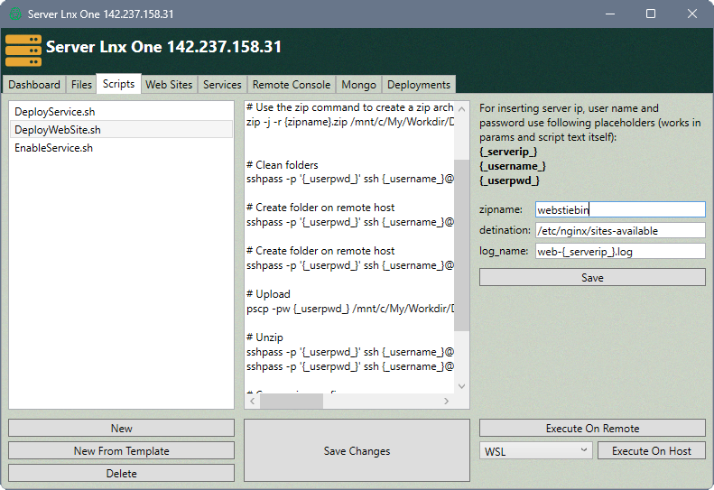

## Empower Your Server Management with **Personal Server Manager**

### Elevate your server management experience with **Personal Server Manager**, tailor-made for individual users overseeing personal or home projects. Whether you're a tech enthusiast managing a home server or a hobbyist running pet projects, our WPF application is designed to empower you with seamless remote server administration capabilities.

### Features Overview

#### Intuitive Dashboard
Stay in control of your servers with a sleek and user-friendly dashboard. Monitor server health, track performance metrics, and receive real-time notifications all in one central location.

#### Remote Deployment
Effortlessly deploy updates, patches, and applications to your servers remotely. Our app simplifies the deployment process, saving you time and reducing the risk of errors.

#### Script Automation
Automate repetitive tasks and workflows with our built-in script automation feature. Write custom scripts or choose from a library of pre-configured scripts to streamline your operations.

### Screenshots

#### Deployments View

#### Server View
